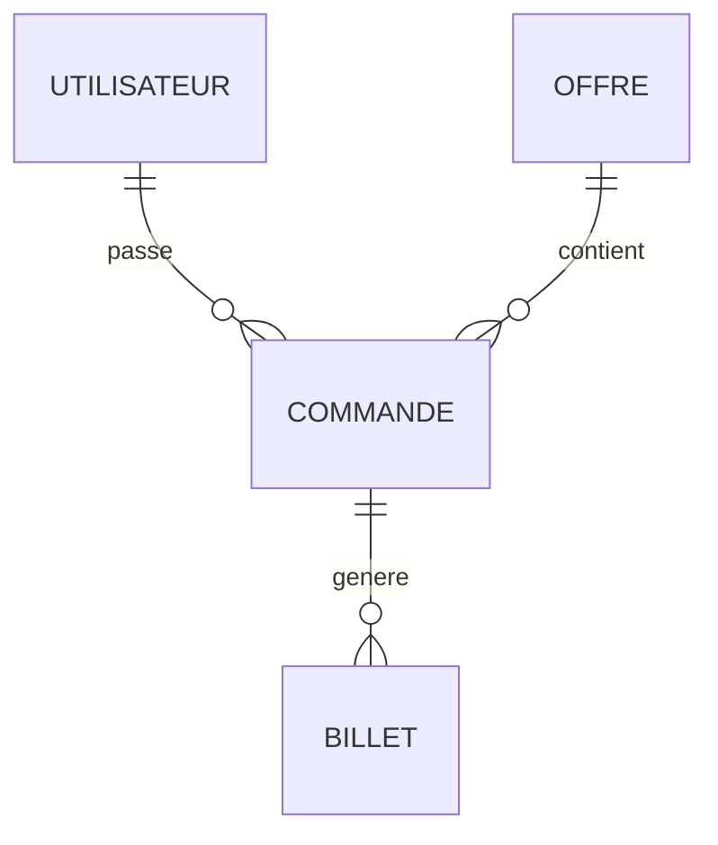

# 🚀 Initialisation de Prisma et Configuration de la Base de Données

## Description

Cette PR initialise Prisma et met en place la structure de base de données pour l'application e-billets JO 2024.

### 📋 Changements effectués

- Initialisation de Prisma dans le backend
- Création du schéma de base de données avec les modèles :
  - `User` (utilisateurs)
  - `Offre` (offres de billets)
  - `Commande` (commandes)
  - `Billet` (billets)
- Configuration des enums :
  - `UserRole` (USER, ADMIN)
  - `OffreType` (SOLO, DUO, FAMILLE)
  - `CommandeStatut` (EN_ATTENTE, PAYEE, ANNULEE, REMBOURSEE)
- Mise en place des relations entre les modèles
- Création et application de la migration initiale
- Mise à jour des dépendances Prisma vers la dernière version

### 🔐 Sécurité

- Utilisation d'UUID pour les identifiants
- Champs préparés pour le stockage sécurisé des clés
- Contraintes d'unicité sur les emails et QR codes

### 📊 Structure de la base de données

## 🧪 Tests

- [ ] La migration s'applique correctement
- [ ] Les modèles sont générés
- [ ] La connexion à la base de données fonctionne

## 📝 Notes

- La configuration de la base de données se fait via le fichier `.env`
- Les variables d'environnement nécessaires ont été documentées
- Le schéma est évolutif pour les futures fonctionnalités

## 📚 Documentation

- Le schéma de base de données est documenté dans `documentation.md`
- Les commentaires dans `schema.prisma` expliquent les choix techniques

## ⚡ Breaking Changes

Aucun (première initialisation)

## 🔄 Dépendances

- Mise à jour de Prisma vers la dernière version
- Ajout de @prisma/client

## 📋 Checklist

- [x] Le code suit les standards du projet
- [x] La documentation a été mise à jour
- [x] Les migrations sont réversibles
- [x] Les noms des tables sont en français
- [x] Les contraintes de base de données sont en place

# 🔄 Configuration du Workflow CI

## Description

Cette PR met en place le workflow d'intégration continue (CI) avec GitHub Actions pour automatiser les tests, le linting et le build du projet.

## 📦 Changements effectués

### 🔧 Configuration du Workflow CI

- Configuration du job `test-and-lint` :
  - ✅ Mise en place d'un service PostgreSQL pour les tests
  - ✅ Vérification du code avec ESLint
  - ✅ Vérification du formatage avec Prettier
  - ✅ Exécution des tests avec Jest
- Configuration du job `build` :
  - ✅ Build du frontend (Vite)
  - ✅ Build du backend (TypeScript)

### 🎯 Déclencheurs

- Push sur la branche `main`
- Pull Requests vers `main`

## 🧪 Tests

Le workflow lui-même exécute :

- Tests unitaires du frontend
- Tests unitaires du backend avec base de données de test
- Vérification du linting et formatage
- Vérification de la compilation

## 📋 Points d'attention pour la review

- Vérifier la configuration PostgreSQL pour les tests
- Vérifier les versions de Node.js et des dépendances
- Vérifier les commandes de build pour chaque workspace

## 🔜 Prochaines étapes

- [ ] Configuration des checks de PR
- [ ] Configuration du déploiement continu (CD)
- [ ] Configuration du monitoring et des alertes
